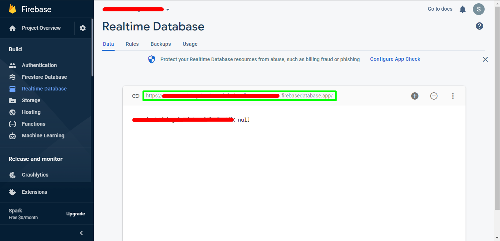

# Getting Started

Before you can use RobaseService you will first need to create a new Firebase project, this can be done from the [Firebase Console](https://console.firebase.google.com/). Once you have followed the instructions and started a new project, you will need to open the side-bar menu and go to your "Realtime Database" and then "Create Database", you will then have a pop-up appear configuring your database and the security rules for it.

## Finding your Database Url

You can find your Database URL by going to the [Firebase Console](https://console.firebase.google.com/) and opening up your Real-time Database. You should be met with a page that looks like this:

{align=center}

In the green box is your URL, it should be formatted like so:  
```
{database-name}-default-rtdb-{server-location}.firebasedatabase.app/
```

!!! info
	This is the `baseUrl` parameter of [RobaseService.new()](../../api/#robaseservicenew).

## Finding your Database Secret

Your database secret will be serving as your authentication token for your requests, this can be created or found by following the image and step-by-step instructions below.

When you create your database a database secret should be generated automatically, but you can create more.

!!! caution
	You **must** have created your database first, if you have just created your project you will not be able to create a database secret. Read the opening paragraph of this page for help with creating your database.

{align=center}

1. Begin by navigating to your [Firebase Console](https://console.firebase.google.com/)
2. Click on the gear icon next to 'Project Overview'
3. Click 'Service Accounts' in the tabs that appear
4. Click 'Database Secrets'
	+ If a secret does not this exist then "add" (create) a new one
6. Hover over the secret and reveal it, then copy it and save it somewhere safe.

!!! info
	The value of your database secret is the `token` parameter of [RobaseService.new()](../../api/#robaseservicenew).